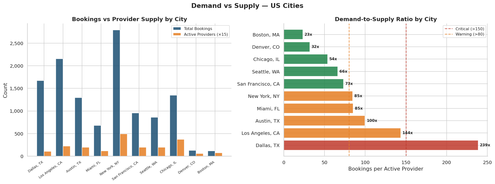
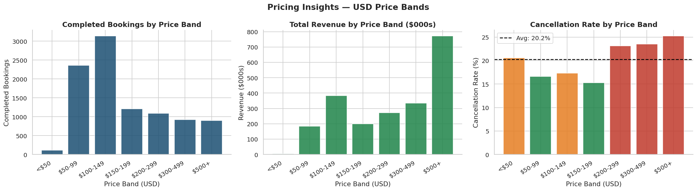
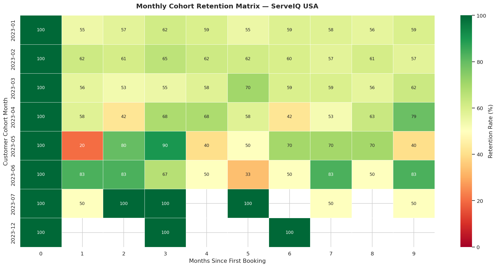
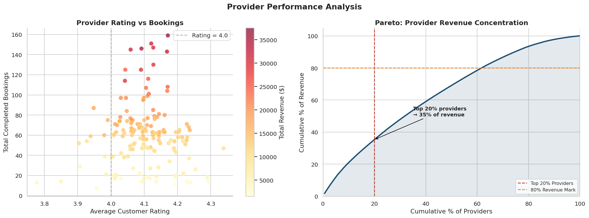
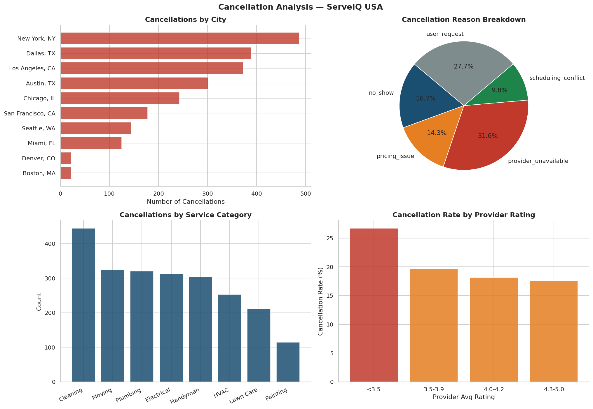

# ServeIQ USA — On-Demand Services Marketplace Analytics

> End-to-end analytics project analyzing a US-based home services marketplace
> across demand intelligence, pricing optimization, customer retention,
> and operational efficiency.


---

## What This Project Is

This project simulates the work a data analyst would do at a company
like TaskRabbit, Angi, or Thumbtack. It covers the full analytics
workflow — from raw data design to SQL analysis to Python
visualizations to business recommendations.

The business problems solved:

| # | Business Question | Method Used |
|---|------------------|-------------|
| 1 | Which US cities have unmet demand? | SQL demand-supply ratio |
| 2 | What price range maximizes bookings? | Price band analysis |
| 3 | Do customers come back? | Cohort retention matrix |
| 4 | Which services drive repeat usage? | Service-level repeat rate |
| 5 | Which providers drive the most value? | Pareto + ranking |
| 6 | Why are bookings being cancelled? | Root cause breakdown |

---

## Dataset

Synthetic dataset designed to mirror real US marketplace behavior.
Generated using Python with intentional business patterns baked in
(Austin and Dallas undersupplied, high-price bookings cancel more, etc.)

| Table | Rows | Description |
|-------|------|-------------|
| bookings | 12,000 | Core fact table — all transactions |
| users | 600 | Customer demographics and signup data |
| providers | 160 | Service professional profiles |
| services | 20 | Service catalog with USD pricing |

**Date range**: January 2023 – June 2024 (18 months)
**Cities**: 10 US metros — NYC, LA, Chicago, Dallas, Austin,
San Francisco, Seattle, Miami, Denver, Boston
**Price range**: $45 – $999 USD

---

## Key Findings

**1. Dallas and Austin are supply emergencies**
- Dallas: 238x demand-to-supply ratio with only 7 active providers
- Austin: 99x ratio with 13 active providers
- Both cities show 23.3% cancellation rate vs 17% platform average
- Root cause: provider recruitment did not keep pace with demand growth

**2. The $100–$149 price band is the volume sweet spot**
- Highest booking volume: 3,794 bookings
- Cancellation rate: 17.3% — near platform average
- Standard Cleaning, Ceiling Fan Install, and Outlet Installation
  live in this band

**3. $150–$199 has the lowest cancellation rate (15.3%)**
- Customers in this band are the most committed
- Price is high enough to signal value, low enough to avoid hesitation

**4. Cancellations spike above $200**
- $200–$299: 23.1% cancellation rate
- $300–$499: 23.5% cancellation rate
- $500+: 25.2% cancellation rate
- 8 percentage points above the sweet spot band

**5. Platform retains 54–65% of customers through Month 6**
- Exceptionally strong for a services marketplace
- Retention actually increases after Month 1 — habitual usage pattern
- January cohort is largest (365 users) — strong new year demand

**6. Provider unavailability is the #1 cancellation driver**
- Appears as top reason across NYC, LA, Chicago, Dallas, Austin
- Cleaning + Mid price ($100–$199) is most cancelled combination
- Good-rated providers (4.0–4.4) still show availability cancellations

---

## Recommendations

**1. Texas Supply Expansion Sprint (90 days)**
- Waive provider onboarding fees in Dallas and Austin
- Guarantee 8 completed jobs in first 30 days for new providers
- Launch Refer-a-Pro: $75 per referral who completes 10 jobs
- Expected impact: 750 additional bookings/month = ~$109K revenue

**2. Price Lock Deposit for Bookings Above $200**
- Require $25 non-refundable deposit at booking time
- Apply deposit toward final price on completion
- Expected impact: 30% reduction in $200+ cancellations

**3. Provider Auto-Reassignment System**
- 90-minute confirmation window for providers
- Auto-reassign if not accepted
- Cancellation strike system for repeat offenders

---

## Project Structure
```
serveiq-usa-analytics/
│
├── README.md
├── requirements.txt
│
├── data/
│   └── raw/
│       ├── bookings.csv
│       ├── users.csv
│       ├── providers.csv
│       └── services.csv
│
├── notebooks/
│   └── analysis.py
│
├── sql/
│   ├── 01_demand_supply.sql
│   ├── 02_price_analysis.sql
│   ├── 03_repeat_customers.sql
│   ├── 04_cohort_retention.sql
│   ├── 05_provider_performance.sql
│   └── 06_cancellation_analysis.sql
│
└── visuals/
    ├── 01_demand_supply.png
    ├── 02_pricing_analysis.png
    ├── 03_cohort_retention.png
    ├── 04_provider_pareto.png
    └── 05_cancellation_analysis.png
```

## Tools Used

- **Python 3.14** — pandas, numpy, matplotlib, seaborn, scikit-learn
- **PostgreSQL 16** — CTEs, window functions, cohort queries
- **Data generation** — Custom synthetic generator with realistic
  business patterns

---

## How to Run
```bash
# 1. Clone the repository
git clone https://github.com/yourusername/serveiq-usa-analytics.git
cd serveiq-usa-analytics

# 2. Create virtual environment
python3 -m venv venv
source venv/bin/activate

# 3. Install dependencies
pip install -r requirements.txt

# 4. Generate the dataset
python data/generate_data.py

# 5. Load into PostgreSQL
psql postgres -c "CREATE DATABASE serveiq;"
psql serveiq -f sql/setup.sql

# 6. Run Python analysis
python notebooks/analysis.py
```

---

## Visuals

### Demand vs Supply by City


### Price Band Analysis


### Cohort Retention Matrix


### Provider Pareto Analysis


### Cancellation Analysis


---

## Author

**Your Name** | Business Analytics
[LinkedIn](your-linkedin-url) | [GitHub](your-github-url)